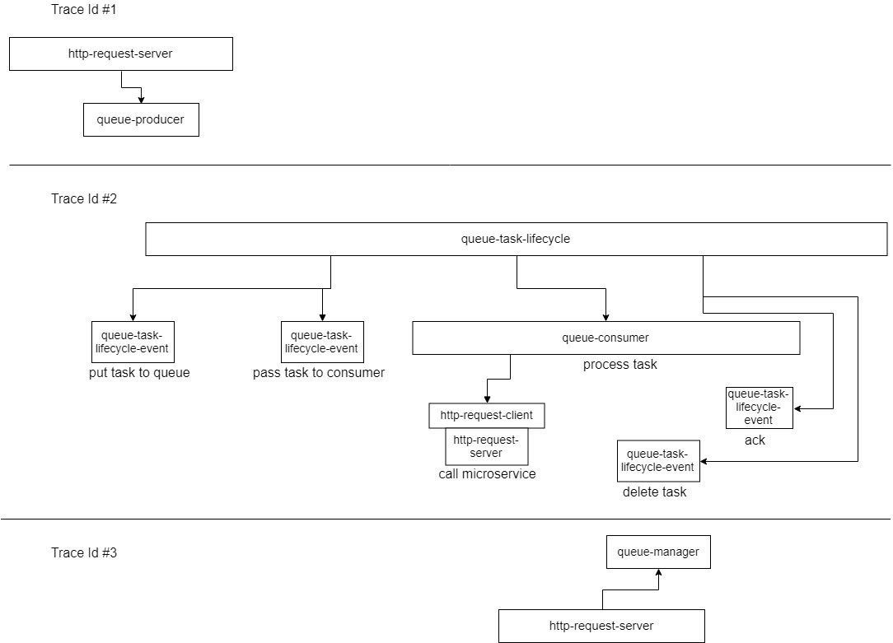

# Vostok tracing

Tracing displays the history of the operations in time in tree form of smaller actions (spans). Spans can be http requests, query to database, and so on. Each kind of span stores specific information about performed action.

Trace has an identifier - traceId, which assigned on input operation (usually on front-end, or for each performing task on queue)

## Trace structure

Span consist of following fields:
* TraceId
* SpanId
* ParentSpanId
* BeginTimestamp (datetime begin of operation)
* EndTimestamp (datetime end of operation, can be null)
* Annotaions (collection of data in key-value form)

Usually, each operation contain following annotations

| Name | Description |
|----|-----|
| operation | Operation name. Should be understood by a person when reading tracing |
| host | Server name where operation processed |
| kind | Span kind. Usefull for trace rendering and atomatic analysys |
| component | Program component - span source |

## HTTP client (direct)

Performing http-request directly to url

| Name | Description | Default value |
|----|-----|----|
| kind |  | http-request-client |
| operation |  | {http.request.method}): {normilized http.request.url}. Example: (POST): /page/{num}/process  |
| service | Microservice name to which the request is made. Set manually or inherit from parent |  |
| http.request.method | http request method (GET, POST, PUT, DELETE, etc) |  |
| http.request.url | url without parameters  |  |
| http.request.contentLength | request body size in bytes |  |
| http.response.statusCode | http response code status |  |
| http.response.contentLength | response body size in bytes |  |

Normilized url - short url without scheme, host, query. Replaced segments that are not valuable for the identification of the operation (for example, id entities, search queries, hex)

## HTTP client (cluster)

Performing http-request using cluster library. Describes operation for obtaining data using replicas

| Name | Description | Default value |
|----|-----|----|
| kind |  | http-request-cluster |
| operation |  | {http.request.method}): {normilized http.request.url}. Example: (POST): /page/{num}/process  |
| service | Microservice name to which the request is made. Set to child spans |  |
| cluster.requestStrategy | request strategy |  |
| cluster.status | status performig request using cluster  |  |
| http.request.method | http request method (GET, POST, PUT, DELETE, etc) |  |
| http.request.url | url without parameters  |  |
| http.request.contentLength | request body size in bytes |  |
| http.response.statusCode | http response code status |  |
| http.response.contentLength | response body size in bytes |  |

## HTTP server

Handle http request by server

| Name | Description | Default value |
|----|-----|----|
| kind |  | http-request-server |
| operation |  | {http.request.method}): {normilized http.request.url}. Example: (POST): /page/{num}/process  |
| service | Microservice name to which the request is handle. |  |
| http.client.name | http client name |  |
| http.client.address | http client address (ip address or host)  |  |
| http.request.method | http request method (GET, POST, PUT, DELETE, etc) |  |
| http.request.url | url without parameters  |  |
| http.request.contentLength | request body size in bytes |  |
| http.response.statusCode | http response code status |  |
| http.response.contentLength | response body size in bytes |  |

## Database

Perform query to database

| Name | Description | Default value |
|----|-----|----|
| kind |  | db-request |
| operation | Database operation name. For example, reading data from table X, execute stored procedure Y, insert data to table Z, etc  |  For example, Insert data to [dbo].[Tasks], Execute stored procedure [UpdateData] |
| db.type | Database type (mssql, cassandra, red, etc) |  |
| db.executionResult | Result of performing request to database |  |
| db.instance | (Usefull for MS SQL) Instanse database server |  |

## Queue (producer)

Insert task to queue

| Name | Description | Default value |
|----|-----|----|
| kind |  | queue-producer |
| operation |  | ({queue.type}) Put to {queue.topic}. Example, (Echelon) Put to reports |
| queue.type | Queue type (Echelon, RabbitMQ etc) |  |
| queue.topic | Name of type, topic, thread of queue, which inserted task  |  |
| queue.actionResult | Result of action (in this case, insert to queue) |  |
| queue.taskId | Recieved task id |  |
| queue.taskTraceId | Recieved task traceid |  |

## Queue (task-lifecycle)

Root span for processing task. Contains general task description

| Name | Description | Default value |
|----|-----|----|
| kind |  | queue-task-lifecycle |
| queue.type | Queue type (Echelon, RabbitMQ etc) |  |
| queue.topic | Name of type, topic, thread of queue |  |
| queue.taskId | Processing task id |  |

## Queue (task-lifecycle-event)

Describes event by processing task. Usually with empty duration

| Name | Description | Default value |
|----|-----|----|
| kind |  | queue-task-lifecycle-event |
| operation | Operation name (put task to queue, pass task to consumer, prolong, delete etc) |  |
| queue.source.traceId | process TraceId  that trigger the event |  |
| queue.source.spanId | process SpanId  that trigger the event |  |

## Queue (manager)

Change state task operation

| Name | Description | Default value |
|----|-----|----|
| kind |  | queue-manager |
| operation | Operation name (delete, prolong, etc) |  |
| queue.type | Queue type (Echelon, RabbitMQ etc) |  |
| queue.topic | Name of type, topic, thread of queue  |  |
| queue.taskId | Processing task id |  |
| queue.actionResult |  Result of action |  |

## Queue (consumer)

Describes processing task operation

| Name | Description | Default value |
|----|-----|----|
| kind |  | queue-consumer |
| queue.executionResult | Result of processing |  |

## Business logic

Describes the execution of part of the application. 

# Queue tracing

Tracing a queue task is a collection of events that occurred within the lifecycle of the task processing.

1. Each task has own trace
2. General information about task stores in endless root span (doesn't endtimespamp)
3. Before placing task in queue, it need to be enriched with data: create a traceId task, create root span. TraceId can pass the producer
4. After placing task in queue, producer can return traceId and taskId (if they where created by the queue). This data saves in the producer span
5. Root span has `queue-task-lifecycle` kind. All child spans has `queue-task-lifecycle-event` or `queue.consumer` kind
6. Span of `queue-task-lifecycle-event` kind can have link to process trace, which triggered the event
7. Events can be zero duration. For example, the event pass task to the consumer.
8. During the execution of the task, events that change the state of the task can occur (for example, deleting a task by another request). Such events are child of rootspan
9. Spans that change the status of a task are of the type queue-manager

## Echelon tracing 

Since the interaction with the queue broker occurs via http api, the http call spans are stored in the process trace. 

## Tracing queues without a broker or without access to the source code of the broker
Broker's trace actions are performed by a process that works with the task
* When creating a task in the queue, the producer must create a span not only for its own trace, but also create a trace for the task + put in the meta-information of the task.
* If someone needs to change a task, then this action should be reflected not only in the trace of this process, but also in the task trace.
